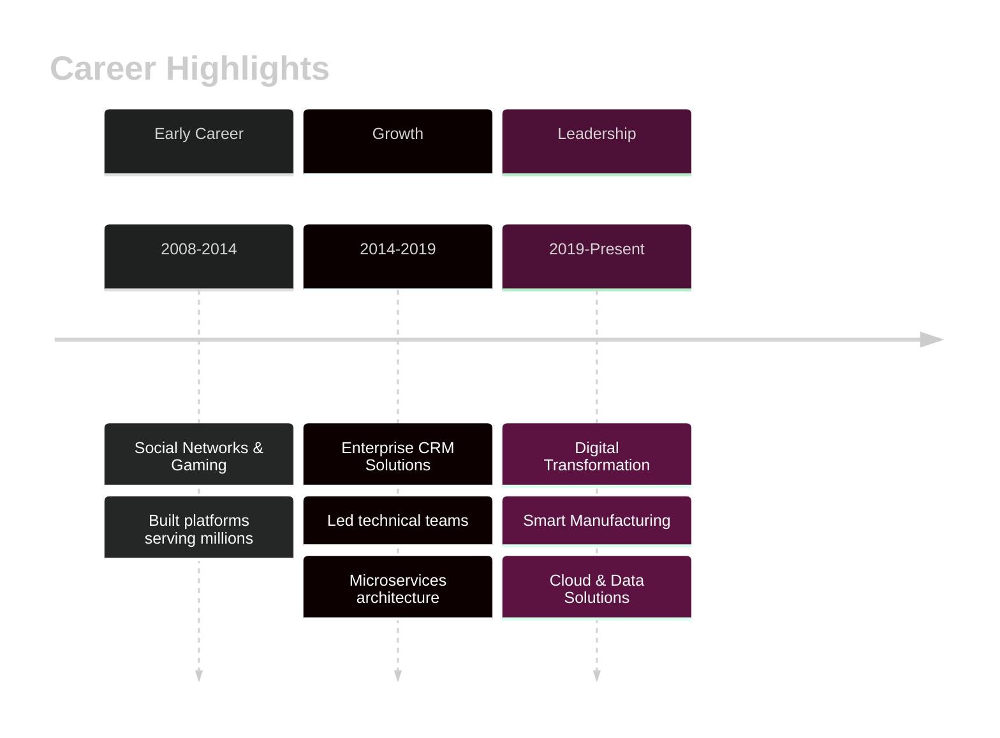

<div align="center">

<!-- Dynamic Typing Animation -->


<h3>🚀 Building scalable enterprise systems that drive business value</h3>

<p>
  <a href="https://linkedin.com/in/shaoqing-zhu"></a>
  <a href="mailto:imroybox@gmail.com"></a>
  
</p>

</div>

---

## 👨‍💻 About Me

```typescript
const roy = {
    location: "Waterloo, ON, Canada 🇨🇦",
    role: "Software Engineer @ SMART Centre, Conestoga College",
    experience: "16+ years",
    focus: ["System Architecture", "Full-Stack Development", "Cloud Solutions", "Data Engineering"],
    background: "Startups → Enterprises → Digital Transformation",
    passion: "Building scalable systems that solve real-world problems"
};
```

**🎯 What I Do:**
- 🏗️ Architect scalable microservices and cloud-native applications
- 🔄 Transform monolithic systems into modern distributed architectures
- 📊 Develop data-driven solutions with real-time analytics
- 👥 Lead technical teams and mentor developers
- 🚀 Drive digital transformation initiatives for industry partners

---

## 🛠️ Tech Stack

### 💻 Languages
<p>
  
</p>

### 🎨 Frontend
<p>
  
</p>

### ⚙️ Backend & Frameworks
<p>
  
</p>

### ☁️ Cloud & DevOps
<p>
  
</p>

### 🗄️ Databases & Tools
<p>
  
</p>

---

## 📊 GitHub Stats

<div align="center">
  
  
</div>

<div align="center">
  
</div>

---

## 🌟 Featured Projects

### 🏭 Manufacturing Visualization System (MVS)
**Vue.js • Django REST • Python • PaddleOCR**

A comprehensive real-time monitoring system for dairy fermentation processes featuring:
- 📊 Live data visualization with Vue.js frontend
- 🔄 RESTful API backend with Django
- 🤖 Automated OCR solution extracting data from legacy LCD displays
- ⚡ Real-time monitoring capabilities for critical manufacturing processes

**Impact:** Transformed manual data collection into automated digital monitoring, improving operational efficiency and data accuracy.

---

### ♻️ Digital Waste Management Solution
**Microsoft 365 • Power Platform • Custom Analytics**

End-to-end digital waste management system addressing SAP implementation gaps:
- 🔗 Seamless Microsoft 365 ecosystem integration
- 📈 Custom analytics dashboards for waste pattern visibility
- 💼 Tailored solution for manufacturing client requirements
- 📊 Real-time reporting and insights

**Impact:** Provided manufacturing client with critical visibility into material waste patterns, enabling data-driven decision making.

---

## 🏆 Achievements

<div align="center">
  
</div>

---

## 📈 Contribution Activity

<div align="center">
  
</div>

---

## 🎓 Education

<table>
<tr>
<td width="50%">

**Graduate Certificate**
📚 Digital Solutions Management
🏫 Conestoga College, ON
📅 2023-2024

</td>
<td width="50%">

**Bachelor's Degree**
📚 Computer Science & Technology
🏫 Huazhong University of Science and Technology
📅 2003-2008

</td>
</tr>
</table>

---

## 💼 Professional Journey



**Career Highlights:**
- 🌐 Built social networking platforms and gaming systems
- 🏢 Developed enterprise-scale CRM solutions
- 🏭 Created smart manufacturing and IoT solutions
- ☁️ Led cloud migration and digital transformation projects
- 👥 Mentored teams across multiple countries and cultures

---

## 🔥 Recent Activity

<!--START_SECTION:activity-->
<!--END_SECTION:activity-->

---

<div align="center">

### 💬 Let's Connect & Collaborate!

I'm always interested in discussing new opportunities, interesting projects, or tech innovations.

<p>
  <a href="https://linkedin.com/in/shaoqing-zhu"></a>
  <a href="mailto:imroybox@gmail.com"></a>
</p>

---

<sub>⭐️ From [royisme](https://github.com/royisme) | Built with ❤️ using modern GitHub Profile tools</sub>

</div>
