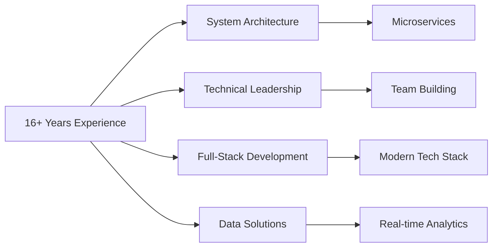

# 👋 Hi, I'm Roy (Shaoqing) Zhu

> *Experienced Software Engineer with 16+ years building scalable enterprise systems*

## 🚀 About Me

I'm a seasoned Software Engineer based in **Waterloo, ON, Canada**, with extensive experience in full-stack development, backend services, cloud infrastructure, and data solutions. Currently leveraging my technical expertise at the SMART Centre at Conestoga College, where I lead digital transformation projects and develop innovative solutions for industry partners.

With a background spanning startups to large enterprises across multiple countries, I specialize in architecting scalable systems, transforming monolithic applications to microservices, and implementing data-driven solutions that drive business value.

## 💼 Professional Journey

## 🛠️ Technical Skills

    

    

    

## 🌟 Recent Projects

### Manufacturing Visualization System (MVS)
- Led development of a complete MVS using Vue.js frontend and Django REST backend
- Implemented real-time monitoring capabilities for dairy fermentation processes
- Engineered an automated OCR solution using Python and PaddleOCR to extract data from legacy LCD displays

### Digital Waste Management Solution
- Designed and implemented a complete digital waste management system for a manufacturing client
- Integrated with Microsoft 365 ecosystem to address gaps in existing SAP implementation
- Created custom analytics dashboards to provide visibility into material waste patterns

## 📈 GitHub Stats

## 🎓 Education

- **Graduate Certificate in Digital Solutions Management**  
  Conestoga College, ON, Canada (2023-2024)
  
- **Bachelor's Degree in Computer Science and Technology**  
  Huazhong University of Science and Technology, China (2003-2008)

## 🔄 Professional Evolution

From building social networking platforms and gaming systems to developing enterprise-scale CRM solutions and manufacturing visualization systems, my career spans diverse industries and technologies. I've successfully led digital transformation initiatives and built systems serving millions of users.

## 📫 Let's Connect

---

<picture>
  <source media="(prefers-color-scheme: dark)" srcset="https://raw.githubusercontent.com/royisme/royisme/output/github-contribution-grid-snake-dark.svg">
  <source media="(prefers-color-scheme: light)" srcset="https://raw.githubusercontent.com/royisme/royisme/output/github-contribution-grid-snake.svg">
  
</picture>
